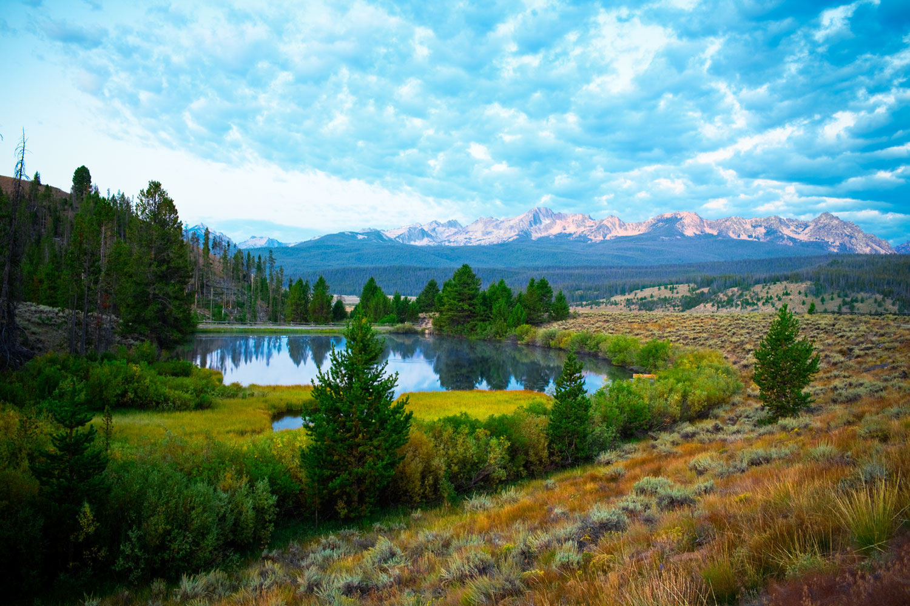
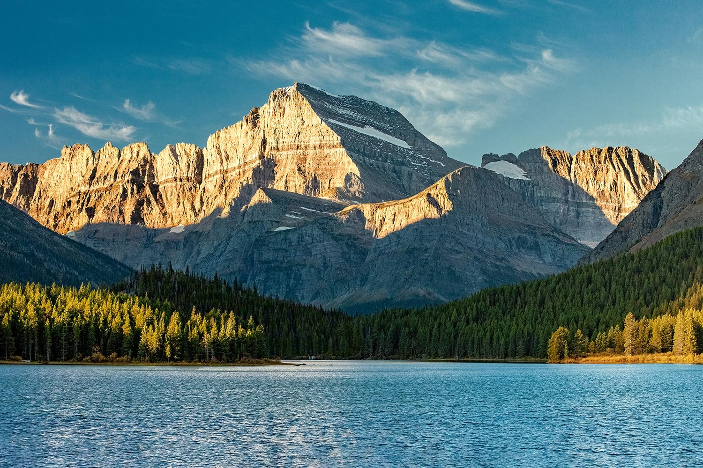

# Capstone 2 - Enjoy the Outdoors

The goal of this project was to build a website that helps the user find things to enjoy the great outdoors. The site specializes in finding national parks to enjoy and mountains to climb. I used what I know about HTM, CSS, and JavaScript to complete this project.

## Table of Contents
- **Homepage** - This is just simple page that features a carousel and two images, each paired with a paragraph, the first of which is filler text and the second is a mountain joke :)
- **A National Parks Search Page** - Includes a series of dropdown lists that allow the user to filter a list of National Parks by location, park type, or just display the entire list. Once the desired list is displayed the user can then select a park to get more information on. If the park has a website then a button to open the website in a different tab will be displayed along with the park information.
- **Mountains Information Page** - Includes a dropdown list with 48 mountains that the user can select from. Once selected, a photo of the mountain will be displayed along with some information about it.

## Images
#### Carousel Images

#### Other Homepage Images

#### Background Images

## License

[MIT](https://choosealicense.com/licenses/mit/)